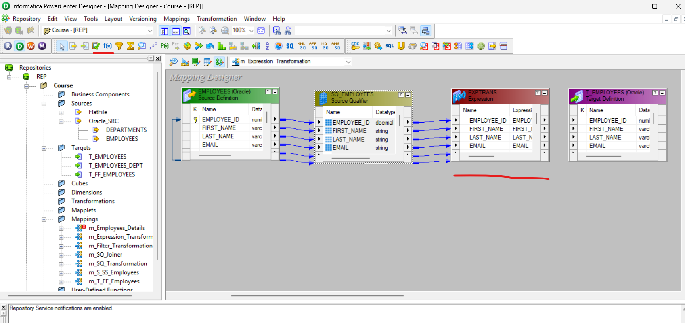

# init
```bash
### Download Oracle and set up config
# HR
alter user hr identified by hr account unlock;

# CORE
create user core identified by core;
grant dba to core;

# INFA
create user infa identified by infa;
grant dba to infa;

# TEST
create user test identified by test;
grant dba to test;

# TABLE
CREATE TABLE CORE.T_EMPLOYEES AS SELECT * FROM HR.EMPLOYEES WHERE 1=2;

SELECT *
FROM T_EMPLOYEES; # IN CORE SCHEMA

SELECT *
FROM EMPLOYEES; # IN HR

# Install IPC server
# Administrator
# Administrator

```
### Client components
1. Repository Manager (R)
2. Designer (D)
3. Workflow Manager (W)
4. Workflow Monitor (M)

#### Repository Manager (R) Admind related task
- Folder creaton/ deeltion
- Access / Priviledges
- Code Migration
- Historical run status

#### Desginer (D) Developer
- Source definiton
- Target Definition
- Mapping (Bussines Logic)

#### 1. Source Analyzer - Source Definition
* Relational DB Table
* Flat files (txt/csv)
* Cobol
* XML Files

#### 2. Target Designer - Target Definition
* Relational DB table
* Flat files (txt/csv)
* XML files

#### 3. Transformation Developer
* Convert info
* Reusable transformation
* Single transformation
* Can be re-used in multiple mapping

#### 4. Mapplet Designer
* Reusable trnaformation
* Set of Transformation to create a reusable logic
* Can be reused in multiple mapping

#### 5. Mapping Designer
* Mapping


#### Workflow Manager (W)
- Session
- Connection
- Workflow

#### 1. Task Developer
- Single session (reusable session)
- Connections definition

#### 2. Worklet Designer
- Reusable component
- Session leve
- Set of sessions

#### 3. Workflow Designer


#### Workflow Monitor (M)
* Run status (Running/Succeeded/failed/aborted/stopped)
* Row count(source/target)
* Throughput (record/sec)
* Session log

### NOM


### Informatica Table to Flat File load
Different types od data load:
1. Table to table
2. Flat file to table
3. Table to flat file

### Flat file to table
+ Add file name column in the flat table


+ We need to add an expression transformation


+ In the new transformation, add a new column for the file name, change params and click on EXPRESSIONS:


+ Put a date metadata in file with itst respective format (double click to insert standard fn)
```bash
'T_FF_Employees'||TO_CHAR(SYSTIMESTAMP(), 'MMDDYYYYHH24MISS')||'.csv'
```


* This example is only for add a current timestamp to the flat file (table to flat file):


### Flat file to table
#### In Source
+ Create a csv file (we nedd to add it in SrcFiles into Informatica folder)
+ In `Sources`, we click on `Import from File`


#### In Target
+ Add the EMPLOYEES table


#### In Mapping
+ Create a new mapping
+ Add Source file and target


+ We need to provide date format from the flat file


#### In workflow
+ Create a new workflow


+ It's important to change date format at the moment to load files
+ Change to the TGT in the wh mapping

### What is Active and Passive transformation in informatica
+ Active: A trnasformation does change the number of records passed through it
+ Passive: A transformtaion does not chenge the number of records passed through it
  

### Source Qualifier Transformation in informatica
- An active, connected
    It converts source datatype into Informatica native data type

- Properties:

```SQL
SELECT all_columns FROM table_name;
```

1. SQL query: SQL override, -- by writing sql qery, we can filter, restrcit the data from source itself -- 2

2. User defined join: Homogeneus join -- tables from same type od DB

3. Source filter: Filter condition (salary is not null)

4. Select distinct: enable/disable

5. Pre-SQL: SQL, before data fetch (ex. index creation in source)

6. Post-SQL: SQL, after data fetch (ex. index drop in source)


- Save mapping
- Refresh Workflow and save it

+ We can view the query in the Workflow task session:


#### Using Source Filter


#### Using Number of Sorted Ports


This one uses the following command:
```sql
ORDER BY 1
ORDER BY 1, 2

SELECT EMPLOYEES.EMPLOYEE_ID, EMPLOYEES.FIRST_NAME, EMPLOYEES.LAST_NAME, EMPLOYEES.EMAIL, EMPLOYEES.PHONE_NUMBER, EMPLOYEES.HIRE_DATE, EMPLOYEES.JOB_ID, EMPLOYEES.SALARY, EMPLOYEES.COMMISSION_PCT, EMPLOYEES.MANAGER_ID, EMPLOYEES.DEPARTMENT_ID FROM EMPLOYEES ORDER BY EMPLOYEES.EMPLOYEE_ID

```


#### Join Defined


- We need to add DEPARTMENTS table in sources
- We need to create table T_EMPLOYEES_DEPT
```sql
CREATE TABLE T_EMPLOYEES_DEPT AS SELECT * FROM T_EMPLOYEES WHERE 1=2;

ALTER TABLE T_EMPLOYEES_DEPT
ADD (
    DEPARTMENT_NAME VARCHAR2(60),
    LOCATION_ID NUMBER(4)
);
```
- Then, we need to add two source tables into only one Source Qualifier. Take columns of DEPARTMENTS and put it on Source Qualifier


- Do the join:


- Create Workflow and run it.
- LEFT OUTER JOIN:
```bash
EMPLOYEES.DEPARTMENT_ID=DEPARTMENTS.DEPARTMENT_ID(+)

```
#### Working with Source Filter


#### Select Distinct columns for a table
- We need to specificate the source table name ad select distinct


### Filter Transformation in informatica
An Active, connected

SQ Filter: source itself

Filter transformation is used to filter out record any where in the pipeline
Properties:
Filter condition:
- True: It will pass all the record
- False: It will block all the record
- Condition: passes --- satisfied record

#### Ex.
```sql
100
200
300
null --- not because is null (salary)
400
500
600
```
#### Ex.
I have a Flat File and it has record for all the countries, i want to load india's data

- When we use a FF, all the SQ options are disabled

```sql
s + sq + filter (country='India' AND salary > 50000)
-- India
-- india
-- INDIA

s + sq + filter (lower(country)='india' AND salary > 50000)
```

- Select filter transformation on the transformation tools area and relate all the columns


- Click on the current table created, put the sentence and click on validate


- Create workflow, change to the target table, save and run


- Adding new filter conditions (AND)


### Expression Transformation in Informatica


- Passive, connected
- Business Logic

||input|output|variable|expression(not a port)|
|---|---|---|---|---|
|salary|*|*|||
|new salary||*||salary+(salary*0.1)|

```bash
variable: intermediate calculation -- you cant take variable port as output

v_c = a + b
o_c = v_c
e = d + v_c

```
- Order of execution
1. Input
2. Variable
3. Output

Can't filter record in expression trnasformation
```bash
if salary <= 5000 --- 30%

if salary > 5000 and <= 10000 --- 20%

if salary > 10000 --- 10%
```

- Do a new mapping and select expression transformation in the toolbar


- We need to create a new port (column) with its data type and length and set the new one like `output` and the original port must be setted like `input`. Then, we need to modify the expression


- Then, we nedd to join with the target table. The original port(column) has not output, whereas the new one hat output. We need to join this one with the target only


```sql
IIF(condition, true, false)

IIF(SALARY <= 10000, SALARY + (SALARY * 0.2), SALARY + (SALARY * 0.1))
```


```sql
if salary <= 5000 --- 30%
if salary > 5000 and <= 10000 --- 20%
if salary > 10000 --- 10%

IIF(SALARY <= 5000, SALARY + (SALARY * 0.3), IIF(SALARY > 5000 AND SALARY <= 10000 , SALARY + (SALARY * 0.2), SALARY + (SALARY * 0.1)))

```
#### Main Exercise
```bash
first_name --- UPERCASE
last_name --- 100_king (EMPLOYEE_ID_LAST_NAME)
email --- salary > 10000 then email@gmail.com
                <= 10000 then email@yahoo.com

phone_number 515.123.4567 --- +1-5151234567
job_id --- from 4th char PRES
comm --- null --- 0
Hire_Date --- leap year

```
#### FIRST_NAME


#### LAST_NAME


#### EMAIL


#### PHONE NUMBER


#### LEAP YEAR


#### COMMISSION_PCT


- Updatting th mapping


#### Evaluation Errors


### Joiner Transformation


- Cick on Joiner Transformation in Mapping toolbar. Automatically identifies details and master itself


- We need to add a new condition and select the relationship bettween master and detail


- In properties section, wen need to set de join type


- The we need to make the relationship between source and target tables


#### Workflow
- Create a mapping, set target, save and run

#### Doing a Master Outer Join


### Sorter Transformation
- An active, connected

```sql
SELECT * FROM EMPLOYEES ORDER BY SALARY
SELECT * FROM EMPLOYEES ORDER BY SALARY DESC
SELECT * FROM EMPLOYEES ORDER BY SALARY DESC, HIRE_DATE
```

||input|output|key|direction|
|---|---|---|---|---|
|salary|*|*|*|descending|
|hire_date|*|*|*|ascending|

- We can seelct more than one key port in sorter

#### Example
- We need to add a Sorter Transformation. This on e is on transformation toolbar. All the soruce clumns must be aggregated.


- Double clikc on created table currently. On `port` section we need to check key property and set the direction


- Case sensitive
```sql
Arun
Babu
babu
Chandra
```
- On `Properties` section, we can set case sentitive, distinct or Null treatment


#### Adding another sorter (hire_date)


- We can use sorter transformation to select ditinct values on a flat file
- We can move the port position in the sorter tansformation table to sort first by salary and the by hire_date


### Aggregator Transformation
- An active, connected

```sql
min()
max()
sum()
avg()
count()

```
- Irrespective of number of record:
1. Yoi wil get onlye one record in output
2. Last recor will get aggregate value

#### Example
```sql
SELECT 
    SUM(SALARY)
FROM DUMMY
```

- Add a new mapping
- Add a aggregator transformation table. This one is in transformations toolbar:


- Double click un the current created table, go to `ports` section and create a new Port like `Output`. Then, set formal `expression`:


- We create the workflow, save and run it

- Then, we need to add `group by` specification


```sql
-- sql
-- ...
GROUP BY DEPARTMENT_ID
HAVING
```
- To make a `HAVING` clause, we need to add a filter in Mapping


#### Sorting + Aggregation
- When we check `sorted input`, the system sort all the columns by grouped column:


- In this case, workflow will fail becasuse we need to set the sorter type, which can be ascendig or descending


### Router Transformation
- An active, connected
- Single source pipeline to multiple pipeline
- Default group
- Multiple filter in single transformation


#### Ex
- First, we need to crate target tables for every distinct country:
```sql
-- In core DB
CREATE TABLE T_EMPLOYEES_INDIA (
    EMPLOYEE_ID NUMBER(6,0),
    FIRST_NAME VARCHAR2(20 BYTE),
    LAST_NAME VARCHAR2(25 BYTE) NOT NULL,
    EMAIL VARCHAR2(25 BYTE) NOT NULL,
    PHONE_NUMBER VARCHAR2(20 BYTE),
    HIRE_DATE DATE NOT NULL,
    JOB_ID VARCHAR2(10 BYTE) NOT NULL,
    SALARY NUMBER(8,2),
    COMMISSION_PCT NUMBER(2,2),
    MANAGER_ID NUMBER(6,0),
    DEPARTMENT_ID NUMBER(4,0),
    COUNTRY VARCHAR2(30 BYTE)
);

CREATE TABLE T_EMPLOYEES_UK (
    EMPLOYEE_ID NUMBER(6,0),
    FIRST_NAME VARCHAR2(20 BYTE),
    LAST_NAME VARCHAR2(25 BYTE) NOT NULL,
    EMAIL VARCHAR2(25 BYTE) NOT NULL,
    PHONE_NUMBER VARCHAR2(20 BYTE),
    HIRE_DATE DATE NOT NULL,
    JOB_ID VARCHAR2(10 BYTE) NOT NULL,
    SALARY NUMBER(8,2),
    COMMISSION_PCT NUMBER(2,2),
    MANAGER_ID NUMBER(6,0),
    DEPARTMENT_ID NUMBER(4,0),
    COUNTRY VARCHAR2(30 BYTE)
);

CREATE TABLE T_EMPLOYEES_USA (
    EMPLOYEE_ID NUMBER(6,0),
    FIRST_NAME VARCHAR2(20 BYTE),
    LAST_NAME VARCHAR2(25 BYTE) NOT NULL,
    EMAIL VARCHAR2(25 BYTE) NOT NULL,
    PHONE_NUMBER VARCHAR2(20 BYTE),
    HIRE_DATE DATE NOT NULL,
    JOB_ID VARCHAR2(10 BYTE) NOT NULL,
    SALARY NUMBER(8,2),
    COMMISSION_PCT NUMBER(2,2),
    MANAGER_ID NUMBER(6,0),
    DEPARTMENT_ID NUMBER(4,0),
    COUNTRY VARCHAR2(30 BYTE)
);

CREATE TABLE T_EMPLOYEES_DEFAULT (
    EMPLOYEE_ID NUMBER(6,0),
    FIRST_NAME VARCHAR2(20 BYTE),
    LAST_NAME VARCHAR2(25 BYTE) NOT NULL,
    EMAIL VARCHAR2(25 BYTE) NOT NULL,
    PHONE_NUMBER VARCHAR2(20 BYTE),
    HIRE_DATE DATE NOT NULL,
    JOB_ID VARCHAR2(10 BYTE) NOT NULL,
    SALARY NUMBER(8,2),
    COMMISSION_PCT NUMBER(2,2),
    MANAGER_ID NUMBER(6,0),
    DEPARTMENT_ID NUMBER(4,0),
    COUNTRY VARCHAR2(30 BYTE)
);

-- In HR DB
CREATE TABLE EMPLOYEES_COUNTRY (
    EMPLOYEE_ID NUMBER(6),
    FIRST_NAME VARCHAR2(127),
    LAST_NAME VARCHAR2(127),
    EMAIL VARCHAR2(127),
    PHONE_NUMBER VARCHAR2(127),
    HIRE_DATE DATE,
    JOB_ID VARCHAR2(127),
    SALARY NUMBER(8,2),
    COMMISSION_PCT NUMBER(2,2),
    MANAGER_ID NUMBER(6),
    DEPARTMENT_ID NUMBER(4),
    COUNTRY VARCHAR2(127)
);

-- INSERT SQL script for the EMPLOYEES_COUNTRY table (60 rows)

-- Insert rows with COUNTRY = 'INDIA' (at least 6 times)
INSERT INTO EMPLOYEES_COUNTRY (EMPLOYEE_ID, FIRST_NAME, LAST_NAME, EMAIL, PHONE_NUMBER, HIRE_DATE, JOB_ID, SALARY, COMMISSION_PCT, MANAGER_ID, DEPARTMENT_ID, COUNTRY)
VALUES (1001, 'Amit', 'Sharma', 'amit.sharma@example.com', '91-9876543210', DATE '2023-01-15', 'IT_PROG', 60000, NULL, 103, 60, 'INDIA');

INSERT INTO EMPLOYEES_COUNTRY (EMPLOYEE_ID, FIRST_NAME, LAST_NAME, EMAIL, PHONE_NUMBER, HIRE_DATE, JOB_ID, SALARY, COMMISSION_PCT, MANAGER_ID, DEPARTMENT_ID, COUNTRY)
VALUES (1002, 'Priya', 'Verma', 'priya.verma@example.com', '91-8765432109', DATE '2023-02-20', 'SALES_REP', 55000, 0.15, 105, 80, 'INDIA');

INSERT INTO EMPLOYEES_COUNTRY (EMPLOYEE_ID, FIRST_NAME, LAST_NAME, EMAIL, PHONE_NUMBER, HIRE_DATE, JOB_ID, SALARY, COMMISSION_PCT, MANAGER_ID, DEPARTMENT_ID, COUNTRY)
VALUES (1003, 'Rahul', 'Kumar', 'rahul.kumar@example.com', '91-7654321098', DATE '2023-03-10', 'FIN_ACCOUNT', 58000, NULL, 108, 50, 'INDIA');

INSERT INTO EMPLOYEES_COUNTRY (EMPLOYEE_ID, FIRST_NAME, LAST_NAME, EMAIL, PHONE_NUMBER, HIRE_DATE, JOB_ID, SALARY, COMMISSION_PCT, MANAGER_ID, DEPARTMENT_ID, COUNTRY)
VALUES (1004, 'Sneha', 'Gupta', 'sneha.gupta@example.com', '91-6543210987', DATE '2023-04-01', 'HR_REP', 52000, NULL, 101, 40, 'INDIA');

INSERT INTO EMPLOYEES_COUNTRY (EMPLOYEE_ID, FIRST_NAME, LAST_NAME, EMAIL, PHONE_NUMBER, HIRE_DATE, JOB_ID, SALARY, COMMISSION_PCT, MANAGER_ID, DEPARTMENT_ID, COUNTRY)
VALUES (1005, 'Vikram', 'Singh', 'vikram.singh@example.com', '91-5432109876', DATE '2023-05-12', 'IT_PROG', 62000, NULL, 103, 60, 'INDIA');

INSERT INTO EMPLOYEES_COUNTRY (EMPLOYEE_ID, FIRST_NAME, LAST_NAME, EMAIL, PHONE_NUMBER, HIRE_DATE, JOB_ID, SALARY, COMMISSION_PCT, MANAGER_ID, DEPARTMENT_ID, COUNTRY)
VALUES (1006, 'Divya', 'Patel', 'divya.patel@example.com', '91-4321098765', DATE '2023-06-25', 'SALES_MGR', 70000, 0.20, 100, 80, 'INDIA');

-- Insert rows with COUNTRY = 'UK' (at least 6 times)
INSERT INTO EMPLOYEES_COUNTRY (EMPLOYEE_ID, FIRST_NAME, LAST_NAME, EMAIL, PHONE_NUMBER, HIRE_DATE, JOB_ID, SALARY, COMMISSION_PCT, MANAGER_ID, DEPARTMENT_ID, COUNTRY)
VALUES (1007, 'James', 'Smith', 'james.smith@example.com', '44-2071234567', DATE '2023-07-01', 'IT_PROG', 65000, NULL, 103, 60, 'UK');

INSERT INTO EMPLOYEES_COUNTRY (EMPLOYEE_ID, FIRST_NAME, LAST_NAME, EMAIL, PHONE_NUMBER, HIRE_DATE, JOB_ID, SALARY, COMMISSION_PCT, MANAGER_ID, DEPARTMENT_ID, COUNTRY)
VALUES (1008, 'Sarah', 'Jones', 'sarah.jones@example.com', '44-1632123456', DATE '2023-08-18', 'SALES_REP', 58000, 0.12, 105, 80, 'UK');

INSERT INTO EMPLOYEES_COUNTRY (EMPLOYEE_ID, FIRST_NAME, LAST_NAME, EMAIL, PHONE_NUMBER, HIRE_DATE, JOB_ID, SALARY, COMMISSION_PCT, MANAGER_ID, DEPARTMENT_ID, COUNTRY)
VALUES (1009, 'David', 'Brown', 'david.brown@example.com', '44-1414987654', DATE '2023-09-05', 'FIN_ACCOUNT', 60000, NULL, 108, 50, 'UK');

INSERT INTO EMPLOYEES_COUNTRY (EMPLOYEE_ID, FIRST_NAME, LAST_NAME, EMAIL, PHONE_NUMBER, HIRE_DATE, JOB_ID, SALARY, COMMISSION_PCT, MANAGER_ID, DEPARTMENT_ID, COUNTRY)
VALUES (1010, 'Emily', 'Wilson', 'emily.wilson@example.com', '44-1138765432', DATE '2023-10-22', 'HR_REP', 55000, NULL, 101, 40, 'UK');

INSERT INTO EMPLOYEES_COUNTRY (EMPLOYEE_ID, FIRST_NAME, LAST_NAME, EMAIL, PHONE_NUMBER, HIRE_DATE, JOB_ID, SALARY, COMMISSION_PCT, MANAGER_ID, DEPARTMENT_ID, COUNTRY)
VALUES (1011, 'Thomas', 'Taylor', 'thomas.taylor@example.com', '44-1512345678', DATE '2023-11-11', 'IT_PROG', 63000, NULL, 103, 60, 'UK');

INSERT INTO EMPLOYEES_COUNTRY (EMPLOYEE_ID, FIRST_NAME, LAST_NAME, EMAIL, PHONE_NUMBER, HIRE_DATE, JOB_ID, SALARY, COMMISSION_PCT, MANAGER_ID, DEPARTMENT_ID, COUNTRY)
VALUES (1012, 'Olivia', 'Clark', 'olivia.clark@example.com', '44-1216543210', DATE '2023-12-03', 'SALES_MGR', 72000, 0.22, 100, 80, 'UK');

-- Insert rows with COUNTRY = 'USA' (at least 6 times)
INSERT INTO EMPLOYEES_COUNTRY (EMPLOYEE_ID, FIRST_NAME, LAST_NAME, EMAIL, PHONE_NUMBER, HIRE_DATE, JOB_ID, SALARY, COMMISSION_PCT, MANAGER_ID, DEPARTMENT_ID, COUNTRY)
VALUES (1013, 'John', 'Doe', 'john.doe@example.com', '1-2125551212', DATE '2024-01-29', 'IT_PROG', 70000, NULL, 103, 60, 'USA');

INSERT INTO EMPLOYEES_COUNTRY (EMPLOYEE_ID, FIRST_NAME, LAST_NAME, EMAIL, PHONE_NUMBER, HIRE_DATE, JOB_ID, SALARY, COMMISSION_PCT, MANAGER_ID, DEPARTMENT_ID, COUNTRY)
VALUES (1014, 'Jane', 'Smith', 'jane.smith@example.com', '1-4155552323', DATE '2024-02-15', 'SALES_REP', 60000, 0.18, 105, 80, 'USA');

INSERT INTO EMPLOYEES_COUNTRY (EMPLOYEE_ID, FIRST_NAME, LAST_NAME, EMAIL, PHONE_NUMBER, HIRE_DATE, JOB_ID, SALARY, COMMISSION_PCT, MANAGER_ID, DEPARTMENT_ID, COUNTRY)
VALUES (1015, 'Robert', 'Jones', 'robert.jones@example.com', '1-3125553434', DATE '2024-03-01', 'FIN_ACCOUNT', 65000, NULL, 108, 50, 'USA');

INSERT INTO EMPLOYEES_COUNTRY (EMPLOYEE_ID, FIRST_NAME, LAST_NAME, EMAIL, PHONE_NUMBER, HIRE_DATE, JOB_ID, SALARY, COMMISSION_PCT, MANAGER_ID, DEPARTMENT_ID, COUNTRY)
VALUES (1016, 'Linda', 'Williams', 'linda.williams@example.com', '1-2065554545', DATE '2024-04-10', 'HR_REP', 58000, NULL, 101, 40, 'USA');

INSERT INTO EMPLOYEES_COUNTRY (EMPLOYEE_ID, FIRST_NAME, LAST_NAME, EMAIL, PHONE_NUMBER, HIRE_DATE, JOB_ID, SALARY, COMMISSION_PCT, MANAGER_ID, DEPARTMENT_ID, COUNTRY)
VALUES (1017, 'Michael', 'Brown', 'michael.brown@example.com', '1-7135555656', DATE '2024-05-22', 'IT_PROG', 72000, NULL, 103, 60, 'USA');

INSERT INTO EMPLOYEES_COUNTRY (EMPLOYEE_ID, FIRST_NAME, LAST_NAME, EMAIL, PHONE_NUMBER, HIRE_DATE, JOB_ID, SALARY, COMMISSION_PCT, MANAGER_ID, DEPARTMENT_ID, COUNTRY)
VALUES (1018, 'Susan', 'Davis', 'susan.davis@example.com', '1-6175556767', DATE '2024-06-08', 'SALES_MGR', 75000, 0.25, 100, 80, 'USA');

-- Insert 54 more rows with various countries
INSERT INTO EMPLOYEES_COUNTRY (EMPLOYEE_ID, FIRST_NAME, LAST_NAME, EMAIL, PHONE_NUMBER, HIRE_DATE, JOB_ID, SALARY, COMMISSION_PCT, MANAGER_ID, DEPARTMENT_ID, COUNTRY)
VALUES (1019, 'Pierre', 'Dupont', 'pierre.dupont@example.com', '33-1234567890', DATE '2023-01-20', 'FIN_ACCOUNT', 62000, NULL, 108, 50, 'France');

INSERT INTO EMPLOYEES_COUNTRY (EMPLOYEE_ID, FIRST_NAME, LAST_NAME, EMAIL, PHONE_NUMBER, HIRE_DATE, JOB_ID, SALARY, COMMISSION_PCT, MANAGER_ID, DEPARTMENT_ID, COUNTRY)
VALUES (1020, 'Maria', 'Garcia', 'maria.garcia@example.com', '34-912345678', DATE '2023-02-25', 'HR_REP', 56000, NULL, 101, 40, 'Spain');

INSERT INTO EMPLOYEES_COUNTRY (EMPLOYEE_ID, FIRST_NAME, LAST_NAME, EMAIL, PHONE_NUMBER, HIRE_DATE, JOB_ID, SALARY, COMMISSION_PCT, MANAGER_ID, DEPARTMENT_ID, COUNTRY)
VALUES (1021, 'Hans', 'Müller', 'hans.mueller@example.com', '49-301234567', DATE '2023-03-15', 'IT_PROG', 68000, NULL, 103, 60, 'Germany');

INSERT INTO EMPLOYEES_COUNTRY (EMPLOYEE_ID, FIRST_NAME, LAST_NAME, EMAIL, PHONE_NUMBER, HIRE_DATE, JOB_ID, SALARY, COMMISSION_PCT, MANAGER_ID, DEPARTMENT_ID, COUNTRY)
VALUES (1022, 'Chiara', 'Rossi', 'chiara.rossi@example.com', '39-0612345678', DATE '2023-04-05', 'SALES_REP', 59000, 0.16, 105, 80, 'Italy');

INSERT INTO EMPLOYEES_COUNTRY (EMPLOYEE_ID, FIRST_NAME, LAST_NAME, EMAIL, PHONE_NUMBER, HIRE_DATE, JOB_ID, SALARY, COMMISSION_PCT, MANAGER_ID, DEPARTMENT_ID, COUNTRY)
VALUES (1023, 'Kenji', 'Tanaka', 'kenji.tanaka@example.com', '81-3123456789', DATE '2023-05-18', 'FIN_ACCOUNT', 61000, NULL, 108, 50, 'Japan');

INSERT INTO EMPLOYEES_COUNTRY (EMPLOYEE_ID, FIRST_NAME, LAST_NAME, EMAIL, PHONE_NUMBER, HIRE_DATE, JOB_ID, SALARY, COMMISSION_PCT, MANAGER_ID, DEPARTMENT_ID, COUNTRY)
VALUES (1024, 'Li', 'Wei', 'li.wei@example.com', '86-1012345678', DATE '2023-06-30', 'HR_REP', 53000, NULL, 101, 40, 'China');

INSERT INTO EMPLOYEES_COUNTRY (EMPLOYEE_ID, FIRST_NAME, LAST_NAME, EMAIL, PHONE_NUMBER, HIRE_DATE, JOB_ID, SALARY, COMMISSION_PCT, MANAGER_ID, DEPARTMENT_ID, COUNTRY)
VALUES (1025, 'Ahmed', 'Khan', 'ahmed.khan@example.com', '92-2112345678', DATE '2023-07-15', 'IT_PROG', 64000, NULL, 103, 60, 'Pakistan');

INSERT INTO EMPLOYEES_COUNTRY (EMPLOYEE_ID, FIRST_NAME, LAST_NAME, EMAIL, PHONE_NUMBER, HIRE_DATE, JOB_ID, SALARY, COMMISSION_PCT, MANAGER_ID, DEPARTMENT_ID, COUNTRY)
VALUES (1026, 'Sophie', 'Martin', 'sophie.martin@example.com', '33-4567891230', DATE '2023-08-02', 'SALES_MGR', 71000, 0.21, 100, 80, 'France');

INSERT INTO EMPLOYEES_COUNTRY (EMPLOYEE_ID, FIRST_NAME, LAST_NAME, EMAIL, PHONE_NUMBER, HIRE_DATE, JOB_ID, SALARY, COMMISSION_PCT, MANAGER_ID, DEPARTMENT_ID, COUNTRY)
VALUES (1027, 'Carlos', 'Lopez', 'carlos.lopez@example.com', '34-934567891', DATE '2023-09-20', 'FIN_ACCOUNT', 63000, NULL, 108, 50, 'Spain');

INSERT INTO EMPLOYEES_COUNTRY (EMPLOYEE_ID, FIRST_NAME, LAST_NAME, EMAIL, PHONE_NUMBER, HIRE_DATE, JOB_ID, SALARY, COMMISSION_PCT, MANAGER_ID, DEPARTMENT_ID, COUNTRY)
VALUES (1028, 'Anna', 'Schmidt', 'anna.schmidt@example.com', '49-8912345678', DATE '2023-10-08', 'HR_REP', 57000, NULL, 101, 40, 'Germany');

INSERT INTO EMPLOYEES_COUNTRY (EMPLOYEE_ID, FIRST_NAME, LAST_NAME, EMAIL, PHONE_NUMBER, HIRE_DATE, JOB_ID, SALARY, COMMISSION_PCT, MANAGER_ID, DEPARTMENT_ID, COUNTRY)
VALUES (1029, 'Marco', 'Ferrari', 'marco.ferrari@example.com', '39-0298765432', DATE '2023-11-25', 'IT_PROG', 66000, NULL, 103, 60, 'Italy');

INSERT INTO EMPLOYEES_COUNTRY (EMPLOYEE_ID, FIRST_NAME, LAST_NAME, EMAIL, PHONE_NUMBER, HIRE_DATE, JOB_ID, SALARY, COMMISSION_PCT, MANAGER_ID, DEPARTMENT_ID, COUNTRY)
VALUES (1030, 'Yumi', 'Sato', 'yumi.sato@example.com', '81-6123456789', DATE '2023-12-12', 'SALES_REP', 60000, 0.17, 105, 80, 'Japan');

```

- Second, we need to add source (1) and target (4) tables


- We need to add sinlge to many table. Thus one is on the toolbar sectoin of transformations:


- Then, we need to add Groups as many as we need and set `Group Filter Conditions` for everyone


- Afte thath, we need to make the relationship between Route Transformation and Targets


### Rank Transformation
- An active, connected
- Rank only one column

||input|output|rank|groupby|
|---|---|---|---|---|
|salary|*|*|*||
|department_id||||*|

- This is how rank functions:


```sql
SELECT 
    RANK() OVER (ORDER BY SALRY DESC) RNK
FROM 
```
- Propereties:
    1. Top/Bottom: top
    2. Number of rank: 5
    3. Cant do dense rank by usong rans transformation, instead we can do by using expression transformation

#### Example
- Create a source, target and Rank Transformation. This one must be in toolbar section:


- Grouping (top 1 for each department)


#### Exercise


### Sequence Generator
- Passive, connected
- Auto increment numbers

- Properties
1. Start value: 10000000
2. Incremente by: 1
3. End value: 49837509837453092875809
4. Current Value: 10000000
5. Cycle: enable/disable
6. Reset: enable/disable
7. Number cached values: 1000

#### Example
- We need to create a tables in CORE db:
```sql
CREATE TABLE T_EMPLOYEES_HIST (
    EMPLOYEE_KEY NUMBER(18),
    EMPLOYEE_ID NUMBER(6),
    FIRST_NAME VARCHAR2(127),
    LAST_NAME VARCHAR2(127),
    EMAIL VARCHAR2(127),
    PHONE_NUMBER VARCHAR2(127),
    HIRE_DATE DATE,
    JOB_ID VARCHAR2(127),
    SALARY NUMBER(8,2),
    COMMISSION_PCT NUMBER(2,2),
    MANAGER_ID NUMBER(6),
    DEPARTMENT_ID NUMBER(4)
)
```

- Then, we need to select `Sequence Generator` from trnasformation toolbars


- Add the properties in `CURRVAL`


#### RES


#### Example 2


- We need to make the configuration and add a `Filter Transformation`


#### RES


### Union Transformation
- An active, connected
- Same strucured table
- Heterogeneous source

```bash
infa --- Union acts as UNION ALL --- it will not remove duplicate
```
- Exactly opposite to router
- Multiple pipeline input --- Single pipeline output

#### Example
- We need to create source and target tables
```sql
-- In HR DB
CREATE TABLE EMPLOYEES_UNION_1 (
    EMPLOYEE_ID NUMBER(6),
    FIRST_NAME VARCHAR2(127),
    LAST_NAME VARCHAR2(127),
    EMAIL VARCHAR2(127),
    PHONE_NUMBER VARCHAR2(127),
    HIRE_DATE DATE,
    JOB_ID VARCHAR2(127),
    SALARY NUMBER(8,2),
    COMMISSION_PCT NUMBER(2,2),
    MANAGER_ID NUMBER(6),
    DEPARTMENT_ID NUMBER(4)
)

CREATE TABLE EMPLOYEES_UNION_2 (
    EMPLOYEE_ID NUMBER(6),
    FIRST_NAME VARCHAR2(127),
    LAST_NAME VARCHAR2(127),
    EMAIL VARCHAR2(127),
    PHONE_NUMBER VARCHAR2(127),
    HIRE_DATE DATE,
    JOB_ID VARCHAR2(127),
    SALARY NUMBER(8,2),
    COMMISSION_PCT NUMBER(2,2),
    MANAGER_ID NUMBER(6),
    DEPARTMENT_ID NUMBER(4)
)

-- INSERTING DATA
INSERT INTO EMPLOYEES_UNION_1
    SELECT *
    FROM EMPLOYEES
    WHERE EMPLOYEE_ID IN (100,101,102);

INSERT INTO EMPLOYEES_UNION_2
    SELECT *
    FROM EMPLOYEES
    WHERE EMPLOYEE_ID IN (101,102,108,145,146,201,205);


-- In CORE DB
CREATE TABLE T_EMPLOYEES_UNION (
    EMPLOYEE_ID NUMBER(6),
    FIRST_NAME VARCHAR2(127),
    LAST_NAME VARCHAR2(127),
    EMAIL VARCHAR2(127),
    PHONE_NUMBER VARCHAR2(127),
    HIRE_DATE DATE,
    JOB_ID VARCHAR2(127),
    SALARY NUMBER(8,2),
    COMMISSION_PCT NUMBER(2,2),
    MANAGER_ID NUMBER(6),
    DEPARTMENT_ID NUMBER(4)
)


```
- Then, we need to add soruce and target tables. Afther that, we can create a new mapping

- In the `Union`, we need to add a new group to match two soruce tables:


#### To insert only DISTINCT rows
- Just we need to add `Sorter Transformation` and check `Distinct` property


### Connected Lookup Transformation
- Is used to retrieve data based on a specific lookup condition
- We can use it to retrieve values form a databse table for codes used in sources data
- Types:
1. Connected Lookup
2. Unconnected Lookup


- An active, connected, unconnected

#### Example
- First, we need to add soruce and target tables. After that, we select `Lookup Transformation` tool and choose the lookup table:


- Then, add lookup column fomr the source into `Lookup Trnasformation` table and match with the same column in the Lookup table with a condition property:


- We need to make the realtionship between missing columns (we can delete useless ports [MANAGER_ID])


- In `Workflow`, we need to add source into `Transformations` section:


#### RES


#### Adding Filter
- In this case, we need to insert only `DEPARTMENT_NAME` rows with name 'purchasing':


#### RES


#### Two Lookup Tables
- First, we need to create the target table
```sql
-- IN CORE DB
CREATE TABLE T_EMPLOYEES_DEPT_LOC (
    EMPLOYEE_ID NUMBER(6),
    FIRST_NAME VARCHAR2(127),
    LAST_NAME VARCHAR2(127),
    EMAIL VARCHAR2(127),
    PHONE_NUMBER VARCHAR2(127),
    HIRE_DATE DATE,
    JOB_ID VARCHAR2(127),
    SALARY NUMBER(8,2),
    COMMISSION_PCT NUMBER(2,2),
    MANAGER_ID NUMBER(6),
    DEPARTMENT_ID NUMBER(4),
    DEPARTMENT_NAME VARCHAR2(60),
    LOCATION_ID NUMBER(4),
    STREET_ADD VARCHAR2(127),
    CITY VARCHAR2(30),
    COUNTRY_ID CHAR(2)
)


```
- Then, add new source and target tables and make the mapping just like this:


### Unconnected Lookup Transformations


- First, we need to add source, target and expression transformation tables. Then, in the `expression transformation` we add two new ports and uncheck input property:


- In the `Expression editor`, we need to add tbe following expression `:LKP.LKPTRANS(DEPARTMENT_ID)` into the currenty created ports


- After that, we need to add Lookup Tables with the following configuration:


#### RES


### Return multiple columns from Unconnected Lookup


### Why lookup is an active transformation, lookup policy on multiple match


### What is the difference between lookup and Joiner transformation


### Update strategy Transformation in Informatica, SCD type 1 in informatica
- An active, connected
- DD (data driven):
    1. dd_insert 0
    2. dd_update 1
    3. dd_delete 2 (instead of delete, we will soft delete)
    4. dd_reject 3

- Target --- primary key


#### Example
```sql
-- In HR DB
CREATE TABLE S_CUSTOMER_UPD (
    CUST_ID NUMBER,
    CUST_NAME VARCHAR2(30 BYTE),
    EMAIL_ID VARCHAR2(50 BYTE),
    MOBILE_NO NUMBER(10,0),
    CITY VARCHAR2(30 BYTE),
    COUNTRY VARCHAR2(30 BYTE)
) 

-- In CORE DB
CREATE TABLE T_CUSTOMER_UPD (
    CUST_ID NUMBER,
    CUST_NAME VARCHAR2(30 BYTE),
    EMAIL_ID VARCHAR2(50 BYTE),
    MOBILE_NO NUMBER(10,0),
    CITY VARCHAR2(30 BYTE),
    COUNTRY VARCHAR2(30 BYTE)
) 

INSERT INTO S_CUSTOMER_UPD
VALUES (1002, 'edibauer', 'email1@gamil.com', '1234567890', 'city1', 'India');

INSERT INTO S_CUSTOMER_UPD
VALUES (1001, 'name2', 'email2@gamil.com', '7878787878', 'city2', 'India');

INSERT INTO S_CUSTOMER_UPD
VALUES (1003, 'name3', 'email3@gamil.com', '5656565656', 'city3', 'India');

INSERT INTO S_CUSTOMER_UPD
VALUES (1004, 'name4', 'email4@gamil.com', '9898989898', 'city4', 'India');


```
- First, we need to add source and target tables. Then, we need to create a mapping with `Expression Transformation` and `Lookup Transformation`. Lookup table must be on target table.


- After that, we need to change `Expression Transformation` properties and add 2 new `ports`. These must be `insert_flag` and `update_flag`


- Insert


```bash
IIF(ISNULL(lkp_CUST_ID1), TRUE, FALSE)
```

- Update


```bash
IIF(CUST_ID = lkp_CUST_ID1 AND (CUST_NAME != lkp_CUST_NAME1 OR EMAIL_ID != lkp_EMAIL_ID1 OR MOBILE_NO != lkp_MOBILE_NO1 OR CITY != lkp_CITY1 OR COUNTRY != lkp_COUNTRY1), TRUE, FALSE)
```
- Add `Router Transfomration`


- Add `Update Strategy Transformation`
```sql
dd_update
-- IIF(flag=1, dd_update, dd_insert)
```


- Create a copy of the target table and do the relationship with `Update Strategy`


#### Workflow
- Same configuration like others (dont check tuncate in target tables)

#### RES


#### Changing values
- Change any value from Email column
- To re-run workflow task, we need to choose it on Monitoring view and click `Restart Workflow from Task`

### Normalizer
- An active, connected transformation
row --- column
- Transpose the data (SQL: pivot unpivot)
- Cobol Source --- VSAM file --- Instead of SQ, Normalizer will be used
- `GK` - Generated key value
- `GC ID` - Generadted column value

#### Example
- First, we need to create all the tables

```sql
-- In HR DB
CREATE TABLE S_STUDENT_NRM (
    STUD_ID NUMBER,
    STUD_NAME VARCHAR2(127),
    MATHS NUMBER,
    PHYSICS NUMBER,
    CHEMISTRY NUMBER,
    BIOLOGY NUMBER
)

-- In CORE DB
CREATE TABLE T_STUDENT_NRM (
    STUD_ID NUMBER,
    STUD_NAME VARCHAR2(127),
    MARKS NUMBER,
    SUBJECT VARCHAR2(127),
    GK_ID NUMBER,
    GC_ID NUMBER
)

-- Insert data into table (HR schema)
INSERT INTO S_STUDENT_NRM
VALUES (1000, 'Arun', 87, 98, 93, 84);

INSERT INTO S_STUDENT_NRM
VALUES (1001, 'Kannan', 83, 82, 96, 91);

INSERT INTO S_STUDENT_NRM
VALUES (1002, 'Babu', 93, 90, 88, 80);

INSERT INTO S_STUDENT_NRM
VALUES (1003, 'Ramesh', 90, 92, 81, 98);

```

- Then, we need to add source and target tables. After all, add normalizer transformation (we cant drag and drop columns no normlizer transformation)


- Next, we have to add on ly the column references


#### Workflow

#### Add subject info (only get top ranks)
- First, we need to add `Rank Transformation` and make changes into this one


### Transaction Control Transformation
- An acive, connected
- Dynamic file in target

1. SQL: 
    commit/ rollback

2. Informatica:
    TC_COMMIT_BEFORE
    TC_COMMIT_AFTER
    TC_ROLLBACK_BEFORE
    TC_ROLLBACK_AFTER
    TC_CONTINUE_TRANSACTION (default)

Dynamic file in target


### JAVA Transformation
- Provides a simple, native programming interface to define transformation functionality with the java programming language

- If active, the transformation can generate more the one output row for each input row
- If pasive, the transformation generates one output row for each input row

#### Example
- First, we need to add source and target table
```sql
-- In HR DB
CREATE TABLE S_CUSTOMER_JAVA (
    CUST_ID NUMBER,
    CUST_NAME VARCHAR2(127),
    CUST_DOB DATE,
    MOBILE_NUMBER VARCHAR2(255)
)

-- In CORE DB
CREATE TABLE T_CUSTOMER_JAVA (
    CUST_ID NUMBER,
    CUST_NAME VARCHAR2(127),
    CUST_DOB DATE,
    MOBILE_NUMBER NUMBER
)

INSERT INTO S_CUSTOMER_JAVA
VALUES (1000, 'Arun Kumar', '13-10-2010', '9090909090~8989898989~8975630134')

INSERT INTO S_CUSTOMER_JAVA
VALUES (1001, 'John Peter', '10-10-2006', '8080808080~8989898989~5544810680~7984650921')

```
- Then, we need to add `JAVA Transformation` as an active one and make configurations


- After that, enter java code and clip on compile:


```java
String str = mobile_numbers;
String [] tmp;
String delimiter = "~";

tmp = str.split(delimiter);

for (int i = 0; i < tmp.length ; i++ ) {
	o_cust_id = cust_id;
	o_cust_name = cust_name;
	o_dob = dob;
	o_mobile = tmp[i];

	generateRow();
}

```

### SQL Transformation
- An active, connected
- Instead of joiner, lookup

SQL Transformation is used to process SQL queries in the mistream of pipeline
We can insert, update, delete and retrieve rows from database at runtime using SQL transformation

The following SQL statements an be used in the SQL transformtaion

Data definition Statements (CREATE, ALTER, DROP, TRUNCATE, RENAME)
Data manipulation statements (INSERT, UPDATE, DELETE, MERGE)
Data retrieval statement (SELECT)
Data Control Language Statements (GRANT, REVOKE)
Transaction Control Statements (COMMIT, ROLLBACK)

- Add all the column data type and set query

```sql

SELECT DEPARTMENT_NAME, LOCATION_ID
FROM DEPARTMENTS
WHERE DEPARTMENT_ID = ?DEPARTMENT_ID? 

```


#### Workflow


