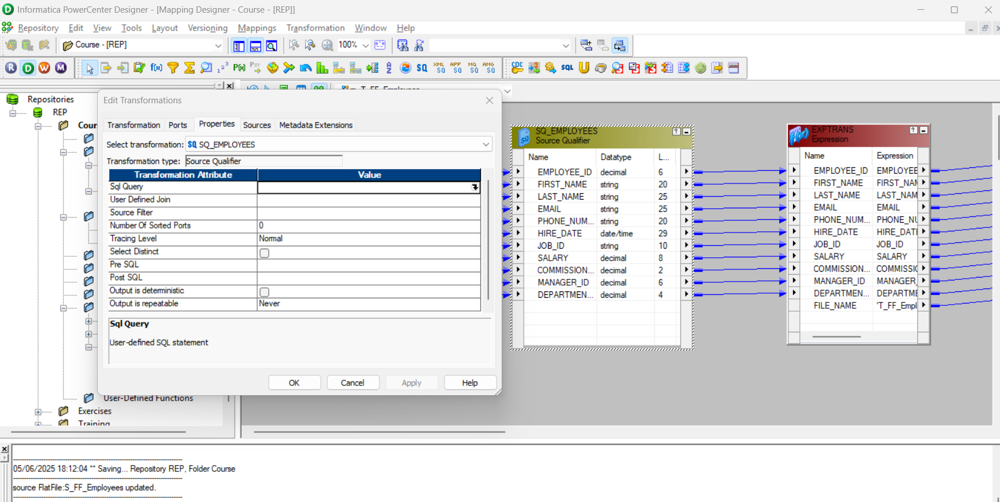

# init
```bash
### Download Oracle and set up config
# HR
alter user hr identified by hr account unlock;

# CORE
create user core identified by core;
grant dba to core;

# INFA
create user infa identified by infa;
grant dba to infa;

# TEST
create user test identified by test;
grant dba to test;

# TABLE
CREATE TABLE CORE.T_EMPLOYEES AS SELECT * FROM HR.EMPLOYEES WHERE 1=2;

SELECT *
FROM T_EMPLOYEES; # IN CORE SCHEMA

SELECT *
FROM EMPLOYEES; # IN HR

# Install IPC server
# Administrator
# Administrator

```
### Client components
1. Repository Manager (R)
2. Designer (D)
3. Workflow Manager (W)
4. Workflow Monitor (M)

#### Repository Manager (R) Admind related task
- Folder creaton/ deeltion
- Access / Priviledges
- Code Migration
- Historical run status

#### Desginer (D) Developer
- Source definiton
- Target Definition
- Mapping (Bussines Logic)

#### 1. Source Analyzer - Source Definition
* Relational DB Table
* Flat files (txt/csv)
* Cobol
* XML Files

#### 2. Target Designer - Target Definition
* Relational DB table
* Flat files (txt/csv)
* XML files

#### 3. Transformation Developer
* Convert info
* Reusable transformation
* Single transformation
* Can be re-used in multiple mapping

#### 4. Mapplet Designer
* Reusable trnaformation
* Set of Transformation to create a reusable logic
* Can be reused in multiple mapping

#### 5. Mapping Designer
* Mapping


#### Workflow Manager (W)
- Session
- Connection
- Workflow

#### 1. Task Developer
- Single session (reusable session)
- Connections definition

#### 2. Worklet Designer
- Reusable component
- Session leve
- Set of sessions

#### 3. Workflow Designer


#### Workflow Monitor (M)
* Run status (Running/Succeeded/failed/aborted/stopped)
* Row count(source/target)
* Throughput (record/sec)
* Session log

### NOM


### Informatica Table to Flat File load
Different types od data load:
1. Table to table
2. Flat file to table
3. Table to flat file


