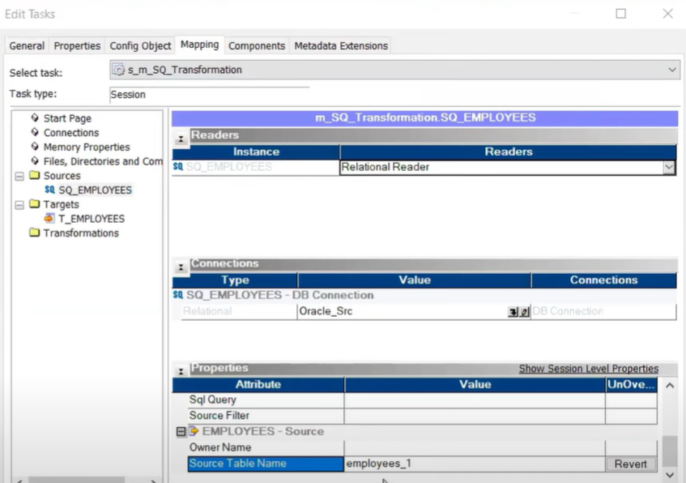

# init
```bash
### Download Oracle and set up config
# HR
alter user hr identified by hr account unlock;

# CORE
create user core identified by core;
grant dba to core;

# INFA
create user infa identified by infa;
grant dba to infa;

# TEST
create user test identified by test;
grant dba to test;

# TABLE
CREATE TABLE CORE.T_EMPLOYEES AS SELECT * FROM HR.EMPLOYEES WHERE 1=2;

SELECT *
FROM T_EMPLOYEES; # IN CORE SCHEMA

SELECT *
FROM EMPLOYEES; # IN HR

# Install IPC server
# Administrator
# Administrator

```
### Client components
1. Repository Manager (R)
2. Designer (D)
3. Workflow Manager (W)
4. Workflow Monitor (M)

#### Repository Manager (R) Admind related task
- Folder creaton/ deeltion
- Access / Priviledges
- Code Migration
- Historical run status

#### Desginer (D) Developer
- Source definiton
- Target Definition
- Mapping (Bussines Logic)

#### 1. Source Analyzer - Source Definition
* Relational DB Table
* Flat files (txt/csv)
* Cobol
* XML Files

#### 2. Target Designer - Target Definition
* Relational DB table
* Flat files (txt/csv)
* XML files

#### 3. Transformation Developer
* Convert info
* Reusable transformation
* Single transformation
* Can be re-used in multiple mapping

#### 4. Mapplet Designer
* Reusable trnaformation
* Set of Transformation to create a reusable logic
* Can be reused in multiple mapping

#### 5. Mapping Designer
* Mapping


#### Workflow Manager (W)
- Session
- Connection
- Workflow

#### 1. Task Developer
- Single session (reusable session)
- Connections definition

#### 2. Worklet Designer
- Reusable component
- Session leve
- Set of sessions

#### 3. Workflow Designer


#### Workflow Monitor (M)
* Run status (Running/Succeeded/failed/aborted/stopped)
* Row count(source/target)
* Throughput (record/sec)
* Session log

### NOM


### Informatica Table to Flat File load
Different types od data load:
1. Table to table
2. Flat file to table
3. Table to flat file

### Flat file to table
+ Add file name column in the flat table


+ We need to add an expression transformation


+ In the new transformation, add a new column for the file name, change params and click on EXPRESSIONS:


+ Put a date metadata in file with itst respective format (double click to insert standard fn)
```bash
'T_FF_Employees'||TO_CHAR(SYSTIMESTAMP(), 'MMDDYYYYHH24MISS')||'.csv'
```


* This example is only for add a current timestamp to the flat file (table to flat file):


### Flat file to table
#### In Source
+ Create a csv file (we nedd to add it in SrcFiles into Informatica folder)
+ In `Sources`, we click on `Import from File`


#### In Target
+ Add the EMPLOYEES table


#### In Mapping
+ Create a new mapping
+ Add Source file and target


+ We need to provide date format from the flat file


#### In workflow
+ Create a new workflow


+ It's important to change date format at the moment to load files
+ Change to the TGT in the wh mapping

### What is Active and Passive transformation in informatica
+ Active: A trnasformation does change the number of records passed through it
+ Passive: A transformtaion does not chenge the number of records passed through it
  

### Source Qualifier Transformation in informatica
- An active, connected
    It converts source datatype into Informatica native data type

- Properties:

```SQL
SELECT all_columns FROM table_name;
```

1. SQL query: SQL override, -- by writing sql qery, we can filter, restrcit the data from source itself -- 2

2. User defined join: Homogeneus join -- tables from same type od DB

3. Source filter: Filter condition (salary is not null)

4. Select distinct: enable/disable

5. Pre-SQL: SQL, before data fetch (ex. index creation in source)

6. Post-SQL: SQL, after data fetch (ex. index drop in source)


- Save mapping
- Refresh Workflow and save it

+ We can view the query in the Workflow task session:


#### Using Source Filter


#### Using Number of Sorted Ports


This one uses the following command:
```sql
ORDER BY 1
ORDER BY 1, 2

SELECT EMPLOYEES.EMPLOYEE_ID, EMPLOYEES.FIRST_NAME, EMPLOYEES.LAST_NAME, EMPLOYEES.EMAIL, EMPLOYEES.PHONE_NUMBER, EMPLOYEES.HIRE_DATE, EMPLOYEES.JOB_ID, EMPLOYEES.SALARY, EMPLOYEES.COMMISSION_PCT, EMPLOYEES.MANAGER_ID, EMPLOYEES.DEPARTMENT_ID FROM EMPLOYEES ORDER BY EMPLOYEES.EMPLOYEE_ID

```


#### Join Defined


- We need to add DEPARTMENTS table in sources
- We need to create table T_EMPLOYEES_DEPT
```sql
CREATE TABLE T_EMPLOYEES_DEPT AS SELECT * FROM T_EMPLOYEES WHERE 1=2;

ALTER TABLE T_EMPLOYEES_DEPT
ADD (
    DEPARTMENT_NAME VARCHAR2(60),
    LOCATION_ID NUMBER(4)
);
```
- Then, we need to add two source tables into only one Source Qualifier. Take columns of DEPARTMENTS and put it on Source Qualifier


- Do the join:


- Create Workflow and run it.
- LEFT OUTER JOIN:
```bash
EMPLOYEES.DEPARTMENT_ID=DEPARTMENTS.DEPARTMENT_ID(+)

```
#### Working with Source Filter


#### Select Distinct columns for a table
- We need to specificate the source table name ad select distinct


